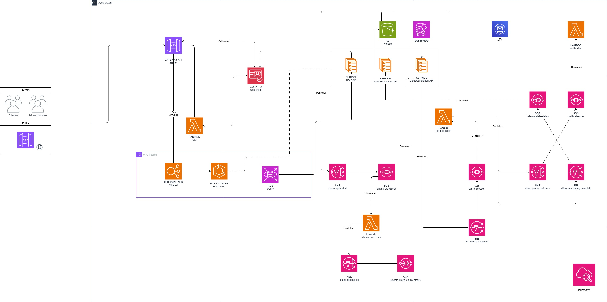

# Documentação da Infraestrutura

## 1. Visão Geral

Esta documentação descreve todos os componentes e serviços que compõem a infraestrutura do projeto. Desse modo, é possível entender mais detalhadamente como cada parte do sistema funciona e como elas se interconectam.
Para facilitar a compreensão, a infraestrutura está dividida em várias camadas, cada uma responsável por um aspecto específico do sistema.

Utilizamos a AWS como provedor de nuvem, aproveitando seus serviços gerenciados para garantir escalabilidade, segurança e eficiência operacional e outros serviços que facilitariam o processo de implantação. A seguir, apresentamos um diagrama detalhado da infraestrutura:

Esta arquitetura foi pensada para garantir escalabilidade, segurança e eficiência no processamento de dados, além de facilitar a manutenção e a evolução do sistema ao longo do tempo. Uma vez que, cada componente é modular e independente, é possível realizar atualizações e melhorias sem afetar o funcionamento geral do sistema.

O ambiente foi desenhado com uma abordagem híbrida entre **microserviços em containers** e **funções serverless**, combinando:

* uma camada de entrada e segurança para autenticação e roteamento;
* uma camada de serviços de negócio para usuários, solicitações de vídeo e acompanhamento do processamento;
* uma camada orientada a eventos para processamento assíncrono, atualização de estado e notificação;
* serviços gerenciados de persistência, armazenamento, mensageria e observabilidade.

---

## 2. Visão geral da topologia

1. **Consumidores externos**
   * Clientes
   * Administradores

2. **Camada de entrada**
   * Amazon API Gateway (HTTP)

3. **Camada de autenticação e autorização**
   * Amazon Cognito (User Pool)
   * AWS IAM (Roles e Policies)

4. **Camada privada de rede e serviços internos**
   * VPC interna
   * VPC Link
   * Internal Application Load Balancer (ALB)
   * ECS Cluster `Hackathon`

5. **Camada de serviços de negócio**
   * [`User-API`](https://github.com/FIAP-11soat-grupo-21/hackathon-user-microservice)
   * [`VideoProcessor-API`](https://github.com/FIAP-11soat-grupo-21/hackathon-video-processor-microservice)
   * [`VideoSolicitation-API`](https://github.com/FIAP-11soat-grupo-21/hackathon-video-solicitation-microservice)

6. **Camada de dados**
   * Amazon RDS (`Users`)
   * Amazon DynamoDB
   * Amazon S3 (`Videos`)

7. **Camada de integração assíncrona**
   * Amazon SNS
   * Amazon SQS
   * AWS Lambda (`chunk-processor`, `zip-processor`, `Notification`)

8. **Camada de observabilidade**
   * Amazon CloudWatch

---

## 3. Componentes e Serviços

### 3.1. Consumidores Externos
**Clientes**: Usuários finais que interagem com o sistema para solicitar processamento de vídeos e acompanhar o status de suas solicitações.

O consumo externo das aplicações ocorre por meio de um endpoint exposto na borda via GatewayAPI, sem acesso direto aos serviços privados da aplicação.

### 3.2. Camada de Entrada
O **API Gateway** atua como porta de entrada única para requisições HTTP.

**Responsabilidades principais:**

* expor endpoints públicos da plataforma;
* aplicar autenticação/autorização antes do roteamento;
* encaminhar tráfego para a rede interna via **VPC Link**;
* desacoplar clientes externos da topologia interna.

### 3.3. Camada de Autenticação e Autorização
A função lambda [`Auth`](https://github.com/FIAP-11soat-grupo-21/hackathon-auth-microservice) é responsável por realizar a solicitação de tokens JWT para os usuários, utilizando o **Amazon Cognito** como provedor de identidade. O Cognito gerencia os usuários, grupos e políticas de acesso, garantindo que apenas usuários autenticados possam acessar os recursos protegidos. Com isso é possível gerar um token JWT que é utilizado para autenticação e autorização nas requisições subsequentes. Esse processo de validação do token é realizado no API Gateway, garantindo que apenas usuários autorizados possam acessar os serviços internos.

**Responsabilidades principais:**
* gerenciar usuários, grupos e políticas de acesso;
* emitir tokens JWT para autenticação;
* validar tokens JWT nas requisições.

### 3.4. Camada Privada de Rede e Serviços Internos
A infraestrutura é configurada para operar em uma **VPC privada**, garantindo isolamento e segurança. O tráfego entre o API Gateway e os serviços internos é roteado por meio de um **VPC Link** para um **Internal Application Load Balancer (ALB)**, que distribui as requisições para os serviços de negócio hospedados no **ECS Cluster `Hackathon`**. Essa configuração garante que os serviços internos não sejam expostos diretamente à internet, aumentando a segurança do sistema.

### 3.5. Camada de Serviços de Negócio
Os serviços de negócio são implementados como microserviços em containers, hospedados no ECS Cluster `Hackathon`. Cada serviço é responsável por uma funcionalidade específica do sistema:
* [`User-API`](https://github.com/FIAP-11soat-grupo-21/hackathon-user-microservice): Gerenciamento de usuários, autenticação e autorização.
* [`VideoProcessor-API`](https://github.com/FIAP-11soat-grupo-21/hackathon-video-processor-microservice): Processamento de vídeos, incluindo divisão em chunks e geração de arquivos ZIP.
* [`VideoSolicitation-API`](https://github.com/FIAP-11soat-grupo-21/hackathon-video-solicitation-microservice): Gerenciamento de solicitações de vídeo, acompanhamento do status e histórico de solicitações.

**Vantagens desta abordagem:**

* isolamento por serviço;
* escala independente por workload;
* atualização controlada por deployment;
* integração nativa com ALB, CloudWatch e demais serviços AWS.

### 3.6. Camada de Dados
A camada de dados é composta por serviços gerenciados da AWS, garantindo alta disponibilidade, escalabilidade e segurança:
* **Amazon RDS**: Utilizado para armazenar dados relacionais, como informações de usuários, grupos e políticas de acesso.
* **Amazon DynamoDB**: Utilizado para armazenar dados de solicitações de vídeo, status de processamento e histórico de solicitações.
* **Amazon S3**: Utilizado para armazenar os vídeos enviados pelos usuários, bem como os arquivos processados (chunks e ZIPs). O S3 oferece alta durabilidade e escalabilidade para armazenamento de objetos, além de integração nativa com outros serviços AWS para processamento e análise de dados.

### 3.7. Camada de Integração Assíncrona
A camada de integração assíncrona é composta por serviços de mensageria e funções serverless, permitindo o processamento assíncrono de tarefas e a comunicação entre os serviços de negócio:
* **Amazon SNS**: Utilizado para publicar eventos relacionados ao processamento de vídeos, como conclusão de chunks ou geração de arquivos ZIP.
* **Amazon SQS**: Utilizado para enfileirar tarefas de processamento, garantindo que as funções Lambda sejam acionadas de forma controlada e escalável.
* **AWS Lambda**: Funções serverless responsáveis por processar os vídeos em chunks (`chunk-processor`), gerar arquivos ZIP (`
zip-processor`) e enviar notificações aos usuários ([`Notification`](https://github.com/FIAP-11soat-grupo-21/hackathon-notification-microservice)). As funções Lambda são acionadas por eventos do SNS ou mensagens do SQS, permitindo um processamento assíncrono eficiente e escalável.

### 3.8. Camada de Observabilidade
A camada de observabilidade é composta por serviços de monitoramento e logging, garantindo visibilidade sobre o desempenho e a saúde do sistema:
* **Amazon CloudWatch**: Utilizado para coletar métricas, logs e eventos de todos os componentes da infraestrutura. O CloudWatch permite configurar alarmes e dashboards para monitorar o desempenho dos serviços, identificar gargalos e responder rapidamente a incidentes.

---

## 5. Fluxos Técnicos da Infraestrutura

### 5.1. Fluxo de Acesso e Autenticação

1. O usuário acessa a plataforma como **Cliente** ou **Administrador**.
2. A chamada HTTP entra pelo **Amazon API Gateway**.
3. O API Gateway utiliza o **Cognito User Pool** como mecanismo de autenticação/autorização.
4. A função **Lambda `Auth`** realiza o processo de login, gerando um token JWT via Cognito.
5. Após autorização, o tráfego é encaminhado via **VPC Link** para o **Internal ALB**.
6. O ALB distribui as requisições aos serviços hospedados no **ECS Cluster**.

### 5.2. Fluxo de Solicitação e Upload de Vídeo

1. O usuário autenticado aciona o `VideoSolicitation-API`.
2. O serviço registra o contexto do vídeo e seus metadados.
3. Os objetos do vídeo são enviados ou referenciados no bucket **S3 `Videos`**.
4. Após a disponibilidade do chunk, um evento `chunk-uploaded` é publicado no **SNS**.
5. O evento é entregue à fila **SQS `chunk-processor`**.

### 5.3. Fluxo de Processamento Paralelo dos Chunks

1. A fila `chunk-processor` aciona a Lambda **`chunk-processor`**.
2. A função processa o chunk individualmente.
3. Ao concluir, publica o evento `chunk-processed` no **SNS**.
4. O tópico distribui o evento para a fila **`update-video-chunk-status`**.
5. O serviço responsável pela atualização de estado consome a fila e persiste o progresso do processamento.

### 5.4. Fluxo de Consolidação Final

1. Quando todos os chunks de um vídeo são concluídos, o serviço publica `all-chunk-processed`.
2. O evento chega à fila **`zip-processor`**.
3. A Lambda **`zip-processor`** consolida os artefatos e gera o arquivo final.
4. O artefato final é armazenado no **S3 `Videos`**.
5. Em seguida, a função publica o resultado em um dos tópicos finais:
   * `video-processing-complete`
   * `video-processed-error`

### 5.5. Fluxo de Atualização de Status e Notificação

1. Os eventos finais são distribuídos para múltiplos consumidores.
2. A fila **`video-update-status`** recebe mensagens para atualização do estado final do vídeo.
3. A fila **`notify-user`** recebe mensagens destinadas ao fluxo de comunicação com o usuário.
4. A Lambda **`Notification`** consome `notify-user`.
5. A Lambda utiliza o **Amazon SES** para envio do e-mail de conclusão ou falha.

---

## 6. Padrões Arquiteturais Adotados

### 6.1. Arquitetura Event-Driven

O uso de **SNS** e **SQS** em sequência, o que configura uma arquitetura orientada a eventos, na qual cada etapa reage à conclusão da etapa anterior. Esse modelo reduz chamadas síncronas entre serviços e melhora a tolerância a falhas.

### 6.2. Fanout com Garantia de Entrega Assíncrona

O padrão **SNS + SQS** permite que um único evento seja entregue a múltiplos consumidores com isolamento entre eles. Assim, atualizar status e notificar usuários são preocupações independentes, embora originadas do mesmo evento de domínio.

### 6.3. Separação entre API, Processamento e Notificação

* **APIs de negócio**: atendimento síncrono e gestão do domínio;
* **Lambdas de processamento**: execução assíncrona e escalável;
* **mensageria**: transporte confiável de eventos;
* **serviço de notificação**: comunicação transacional desacoplada.

### 6.4. Segmentação por Tipo de Persistência

Há uma separação explícita entre:

* **RDS** para dados estruturados de usuário;
* **DynamoDB** para estados e metadados operacionais do pipeline;
* **S3** para arquivos e artefatos binários.

Essa escolha melhora a aderência da infraestrutura ao perfil de acesso de cada domínio.

---

## 7. Segurança e Isolamento

Os seguintes mecanismos de segurança podem ser identificados no desenho:

* **API Gateway como borda controlada**, evitando exposição direta dos serviços internos;
* **Cognito User Pool** como provedor de identidade;
* **VPC interna** protegendo os serviços de negócio e a base relacional;
* **VPC Link + Internal ALB** como caminho privado entre a borda e os containers;
* **filas e tópicos** desacoplando a comunicação entre componentes internos.

Do ponto de vista arquitetural, a solução reduz a superfície pública de ataque e concentra o controle de acesso na camada de entrada.

---

## 8. Escalabilidade, Resiliência e Operação

### 8.1. Escalabilidade

* **APIs em ECS** podem escalar horizontalmente conforme volume de requisições.
* **Lambdas** escalam sob demanda de acordo com o volume nas filas.
* **SQS** absorve picos de carga, evitando sobrecarga imediata nos consumidores.
* **S3** e **DynamoDB** suportam crescimento do volume de dados com baixa necessidade de gestão operacional.

### 8.2. Resiliência

* O uso de filas desacopla produtores e consumidores.
* Falhas em processamento não interrompem diretamente a camada de APIs.
* Eventos finais de sucesso e erro permitem reação explícita do restante do ecossistema.
* O modelo favorece retentativas e reprocessamento orientado a mensagens.

### 8.3. Observabilidade

Com **CloudWatch**, a operação pode acompanhar:

* erros nas Lambdas;
* profundidade de filas SQS;
* falhas de integração entre serviços;
* métricas de tráfego da API;
* logs de execução no cluster e nas funções serverless.
